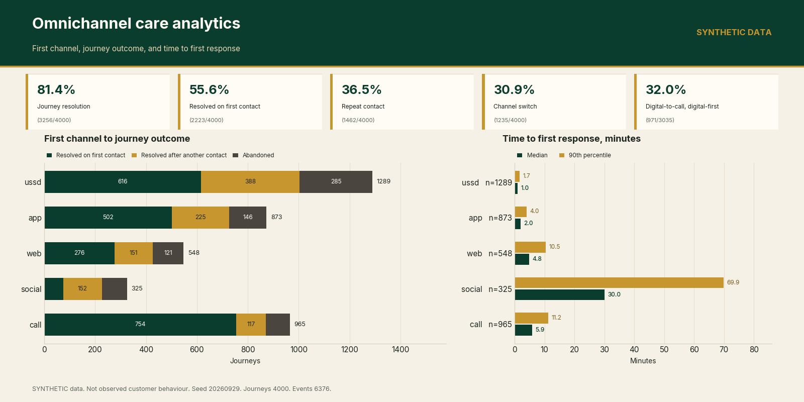
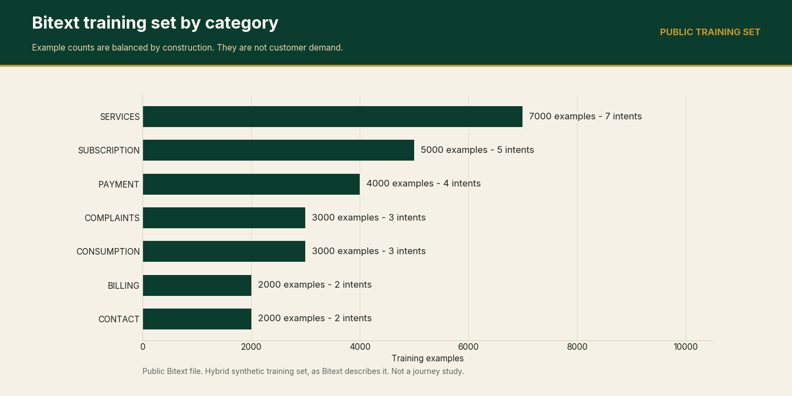
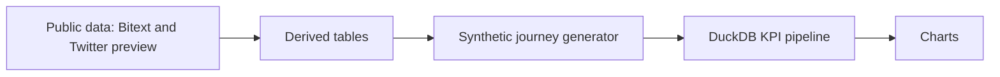
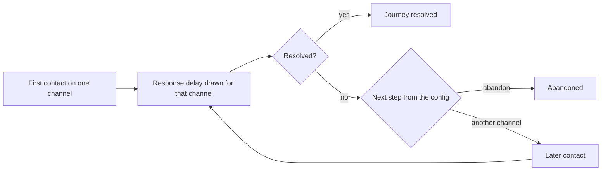
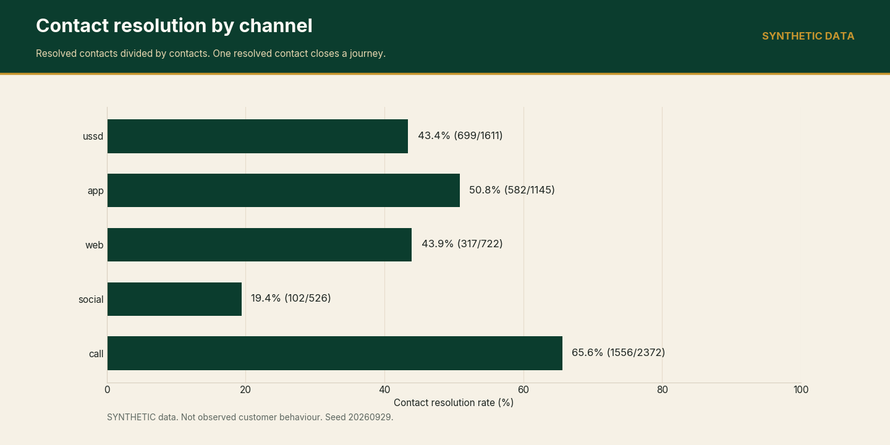
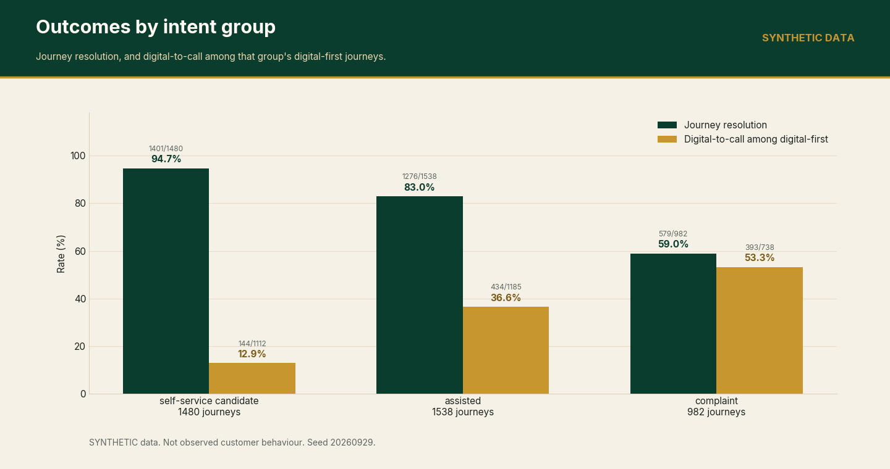
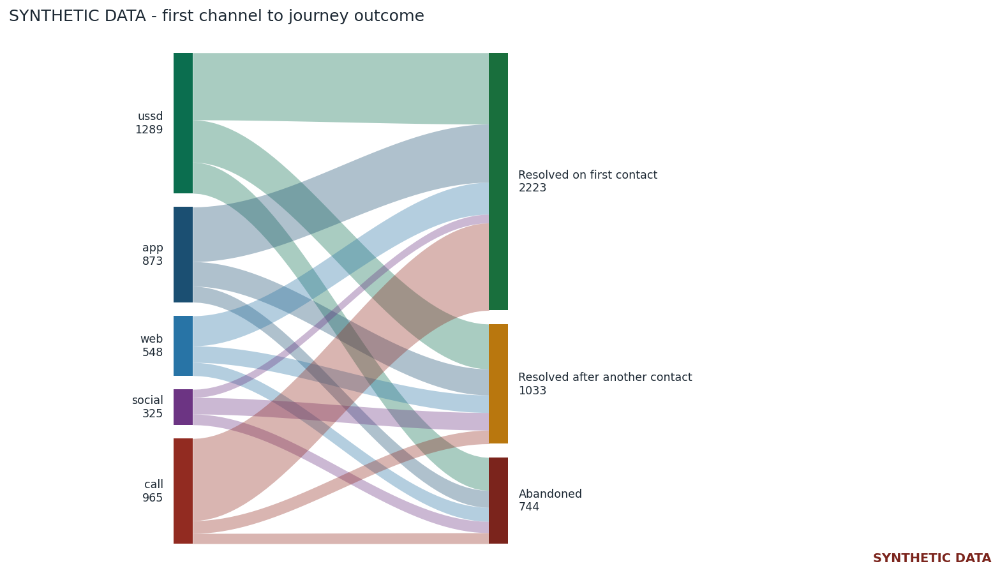
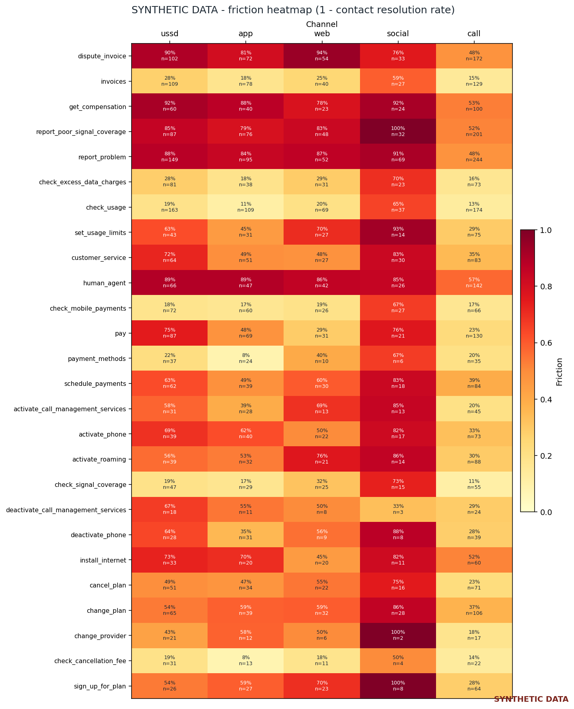

# Omnichannel care analytics

**[Live demo](https://omnichannel-care-analytics.vercel.app)**



SYNTHETIC data, seed 20260929. The hop, the pipeline, and the outcome: 32.0% of digital-first journeys (971/3035) later reach a call.

[](https://github.com/ChristopherKiokoStrathmore/omnichannel-care-analytics/actions/workflows/ci.yml)

[](LICENSE)

## Live demo

[https://omnichannel-care-analytics.vercel.app](https://omnichannel-care-analytics.vercel.app)

Customers bounce between USSD, app, web, social and the call centre before an issue is fixed. How fast is first response, how often do customers retry, and which intents resolve on which channel?

This repo builds a journey KPI pipeline (funnel, time to first response, resolution by channel and intent, directly-follows graph, Sankey and friction heatmap) and profiles the public Bitext telco intent taxonomy. Part of an independent portfolio series on telecom customer analytics, built alongside an MSc in Data Science. Structured using CRISP-DM.

## Key results

Journey figures below are labelled SYNTHETIC and are not real-world measurements. Full figures and definitions: [reports/headlines.md](reports/headlines.md).

- Bitext training examples: 26000. Intents: 26. Categories: 7.
- Twitter preview data rows: 93.
- SYNTHETIC seed 20260929. Journeys: 4000. Events: 6376.
- SYNTHETIC journey resolution rate: 81.4% (3256/4000). Resolved on the first contact: 55.6% (2223/4000).
- SYNTHETIC repeat-contact rate: 36.5% (1462/4000). Channel-switch rate: 30.9% (1235/4000).
- SYNTHETIC digital-to-call rate among digital-first journeys: 32.0% (971/3035).

## Business Understanding

Care teams want to know how long a first response takes, how often a customer has to try again, when a digital attempt ends in a call, and which intents get resolved on which channel. Public data does not contain that multichannel log. Bitext is a training set of intents. The Twitter corpus is a large tweet collection behind a Kaggle login, and the only file reached without credentials is a short preview. This repo therefore does three separate things, and keeps them separate:

- Describe the public Bitext intent taxonomy and its language tags.
- Describe the Twitter preview without treating it as a telco sample.
- Simulate journeys under assumptions that are written down in `config/synthetic.yaml`, then compute the care KPIs on that simulation.

## Data Understanding

| Input | Status | What it is used for |
| --- | --- | --- |
| Bitext telco intents | Public. Hugging Face `bitext/Bitext-telco-llm-chatbot-training-dataset`, licence CDLA-Sharing-1.0, published by Bitext Innovations, 2024. Bitext describes the file as a hybrid synthetic training set. Raw CSV is downloaded, hash-checked, and not committed. | Intent and category names, example counts, language-tag shares, training-utterance lengths. |
| Customer Support on Twitter | The full Kaggle dataset `thoughtvector/customer-support-on-twitter` was not downloaded. Unauthenticated requests did not return the file, and no Kaggle credentials were used. A publisher preview from BERD record `4c9xb-k5q03` was downloaded and hash-checked. The preview is not committed. | Row counts, reply links that stay inside the preview, and which company accounts appear. |
| Multichannel event log | SYNTHETIC. Seeded generator in `care_analytics/synthetic.py`. Assumptions live in `config/synthetic.yaml`. | All journey KPIs, the Sankey, the friction heatmap, and the directly-follows table. |

Bitext's equal example counts are how that training set was built. They are not demand. The Twitter preview is not a random sample of the multi-million-tweet corpus, and most of the company accounts in it are not telecom accounts. The profile of both public files is in [reports/headlines.md](reports/headlines.md).



Bitext training set (public). Example counts by category. Equal counts are how the file was built. They are not demand.

## Data Preparation

`scripts/download_public_data.py` fetches the two public files into `data/raw/` (gitignored) and checks the SHA-256 values in `data/checksums.json`. It then refreshes the small derived tables in `data/derived/`. The raw Bitext CSV and the Twitter preview are not committed.

`scripts/run_analysis.py` does not download anything. It reads the committed Bitext taxonomy table and `config/synthetic.yaml`, regenerates the SYNTHETIC log, and rewrites the KPI file, the charts, `reports/headlines.md`, and `docs/recommendations.md`. The tests check that a fresh run matches the committed events and the committed prose. Commands are under Quickstart.

## Architecture



## Modeling

A SYNTHETIC journey is one customer, one intent, and one or more contacts. The generator draws the intent from the configured weights, using names and categories taken from the Bitext taxonomy table. It draws a first channel, a response delay, and whether that contact resolves. If it does not resolve, the next step is another channel or abandon. The journey stops when it resolves, when the customer abandons, or when it hits the contact cap in the config. There is one journey per customer.



This is the generator, not a map of observed customers. Digital channels are USSD, app, web, and social. The assisted channel is call. A digital-to-call journey is one that starts on a digital channel and later has a call contact.

The analysis on that log is the funnel, time to first response by first channel, contact resolution by channel and by intent group, and the directly-follows graph. The process view is the directly-follows table [reports/charts/SYNTHETIC_directly_follows.csv](reports/charts/SYNTHETIC_directly_follows.csv), aggregated in DuckDB. pm4py is not used. Adding it would have pulled in a larger stack for a graph this table already states. Rate definitions are in [reports/headlines.md](reports/headlines.md). Every displayed rate is formatted from integer counts in `reports/kpis.json`.

## Evaluation

The numbers in [reports/headlines.md](reports/headlines.md) are labelled SYNTHETIC. Complaint journeys move on to the call channel more often than lookup journeys. Assisted journeys sit between those two groups. Among steps that change channel, the largest flow is USSD followed by the call channel. A second contact on the same channel counts as a repeat contact and does not count as a channel switch. The Sankey chart is the same set of journeys split into resolved on the first contact, resolved after another contact, or abandoned. The heatmap is realised friction: one minus the contact resolution rate. Cells sit near the base probabilities in the config, moved by the attempt penalty and the slow-response penalty. That closeness is expected. It is the generator doing what it was told, plus sampling and the two adjustments (later attempts, slow responses).



SYNTHETIC data. Contact resolution rate by channel. A journey has at most one resolved contact.



SYNTHETIC data. Journey resolution, and digital-to-call among digital-first journeys, by intent group.

Charts, both labelled SYNTHETIC. The PNG files are static copies of the same committed counts. The HTML files stay interactive.



Interactive chart: [reports/charts/SYNTHETIC_sankey.html](reports/charts/SYNTHETIC_sankey.html)



Interactive chart: [reports/charts/SYNTHETIC_friction_heatmap.html](reports/charts/SYNTHETIC_friction_heatmap.html)

The one-page note is [docs/recommendations.md](docs/recommendations.md). It is generated from `reports/kpis.json`. Each recommendation names its basis.

- Lookup intents are the self-service shortlist because those public intent names are status checks, not because Bitext measured demand. The SYNTHETIC digital-to-call counts rank which of them to prototype first.
- Complaint intents keep a route to a person. Under these assumptions, USSD is a way to capture the symptom, not the only path.
- Social stays an acknowledgement channel under the clock configured for it.
- The public training utterances are often colloquial and often contain the typo tag, and they are not keyword strings. A USSD path should be a menu. A chat path has to accept that wording. This statement is about the Bitext training set.

Treat the note as a decision about a real operation only after the weights, clocks, and base probabilities in `config/synthetic.yaml` are replaced with operator measurements.

## Deployment

The KPI pipeline stays a local script (`make run`). It does not run as a hosted service. The demo frontend in `web/` is a Next.js App Router app for Vercel. Set the project Root Directory to `web`, then install and build from that directory:

```bash
cd web
npm install
npm run build
```

The pages repeat figures already written in this README and in `reports/`. Seed 20260929. No synthetic rate in the demo is a real-world measurement.

## Quickstart

Requires Python 3.12. From the repository root:

```bash
make install
python scripts/download_public_data.py
make run
make test
```

## Data and scope

Built on public and synthetic data as an independent portfolio project.

## Limitations

- Bitext is a public training set. Bitext calls it hybrid synthetic. Counts are balanced across intents by construction, the language is English, and the file has no channel, no timestamp, and no customer. It cannot support a journey rate or a demand forecast.
- The full Customer Support on Twitter dataset needs a Kaggle login. This repo does not use one. The preview is 93 rows, threads are cut off at the edge of the file, and the accounts are mostly outside telecom. The reply delay is only for pairs that both happen to sit inside the preview. It is not a time-to-first-response for Twitter support, and it is not a telco figure.
- Synthetic resolution chances, channel mix, demand weights, and clocks are assumptions. Editing `config/synthetic.yaml` changes the KPIs. Where a realised rate is close to a base probability, that is the generator doing what it was told, plus sampling and the two adjustments (later attempts, slow responses).
- The synthetic log has one journey per customer, and every contact receives a response. It cannot say anything about people who never get an answer, or about a second, unrelated issue from the same person.
- Nothing here is Kenyan traffic, an operator extract, or a production customer-experience platform.

## Related projects in this series

- [telco-churn-nba-engine](https://github.com/ChristopherKiokoStrathmore/telco-churn-nba-engine)
- [responsible-ai-pack](https://github.com/ChristopherKiokoStrathmore/responsible-ai-pack)
- [care-automation-roi](https://github.com/ChristopherKiokoStrathmore/care-automation-roi)
- [digital-care-roadmap](https://github.com/ChristopherKiokoStrathmore/digital-care-roadmap)
