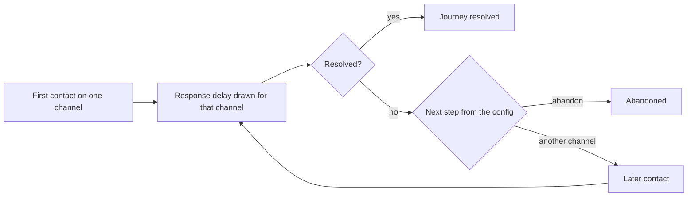

# omnichannel-care-analytics

Public portfolio project by Chris Nguu. It measures care journeys from first contact to resolution across USSD, app, web, social, and the call channel.

Two public files are inputs: the Bitext telco intent training set, and a short publisher preview of Customer Support on Twitter. Every journey KPI comes from a seeded synthetic event log generated in this repository. The synthetic files, charts, and sentences are labelled SYNTHETIC. No synthetic rate in this repository is a real-world measurement. No employer or customer data is used.

## Problem

Care teams want to know how long a first response takes, how often a customer has to try again, when a digital attempt ends in a call, and which intents actually get resolved on which channel. Public data does not contain that multichannel log. Bitext is a training set of intents. The Twitter corpus is a large tweet collection behind a Kaggle login, and the only file reached without credentials is a short preview. This repo therefore does three separate things, and keeps them separate:

- Describe the public Bitext intent taxonomy and its language tags.
- Describe the Twitter preview without treating it as a telco sample.
- Simulate journeys under assumptions that are written down in `config/synthetic.yaml`, then compute the care KPIs on that simulation.

## Data card

| Input | Status | What it is used for |
| --- | --- | --- |
| Bitext telco intents | Public. Hugging Face `bitext/Bitext-telco-llm-chatbot-training-dataset`, licence CDLA-Sharing-1.0, published by Bitext Innovations, 2024. Bitext describes the file as a hybrid synthetic training set. Raw CSV is downloaded, hash-checked, and not committed. | Intent and category names, example counts, language-tag shares, training-utterance lengths. |
| Customer Support on Twitter | The full Kaggle dataset `thoughtvector/customer-support-on-twitter` was not downloaded. Unauthenticated requests did not return the file, and no Kaggle credentials were used. A publisher preview from BERD record `4c9xb-k5q03` was downloaded and hash-checked. The preview is not committed. | Row counts, reply links that stay inside the preview, and which company accounts appear. |
| Multichannel event log | SYNTHETIC. Seeded generator in `care_analytics/synthetic.py`. Assumptions live in `config/synthetic.yaml`. | All journey KPIs, the Sankey, the friction heatmap, and the directly-follows table. |

Bitext's equal example counts are how that training set was built. They are not demand. The Twitter preview is not a random sample of the multi-million-tweet corpus, and most of the company accounts in it are not telecom accounts.

## Journey map

A synthetic journey is one customer, one intent, and one or more contacts. The generator draws the intent from the configured weights, using names and categories taken from the Bitext taxonomy table. It draws a first channel, a response delay, and whether that contact resolves. If it does not resolve, the next step is another channel or abandon. The journey stops when it resolves, when the customer abandons, or when it hits the contact cap in the config. There is one journey per customer.



This is the generator, not a map of observed customers. Digital channels are USSD, app, web, and social. The assisted channel is call. A digital-to-call journey is one that starts on a digital channel and later has a call contact.

## Channel-shift findings

The numbers are in the synthetic block below, and they are synthetic. Complaint journeys move on to the call channel more often than lookup journeys. Assisted journeys sit between those two groups. Among steps that change channel, the largest flow is USSD followed by the call channel. A second contact on the same channel counts as a repeat contact and does not count as a channel switch. The Sankey chart is the same set of journeys split into resolved on the first contact, resolved after another contact, or abandoned. The heatmap is realised friction: one minus the contact resolution rate. Cells sit near the base probabilities in the config, moved by the attempt penalty and the slow-response penalty. That closeness is expected. It is not a second measurement of those probabilities.

Charts, both labelled SYNTHETIC:

- [reports/charts/SYNTHETIC_sankey.html](reports/charts/SYNTHETIC_sankey.html)
- [reports/charts/SYNTHETIC_friction_heatmap.html](reports/charts/SYNTHETIC_friction_heatmap.html)

The process view is the directly-follows table [reports/charts/SYNTHETIC_directly_follows.csv](reports/charts/SYNTHETIC_directly_follows.csv), aggregated in DuckDB. pm4py is not used. Adding it would have pulled in a larger stack for a graph this table already states.

## Recommendations

The one-page note is [docs/recommendations.md](docs/recommendations.md). It is generated from `reports/kpis.json`. Each recommendation names its basis.

- Lookup intents are the self-service shortlist because those public intent names are status checks, not because Bitext measured demand. The synthetic digital-to-call counts rank which of them to prototype first.
- Complaint intents keep a route to a person. Under these assumptions, USSD is a way to capture the symptom, not the only path.
- Social stays an acknowledgement channel under the clock configured for it.
- The public training utterances are often colloquial and often contain the typo tag, and they are not keyword strings. A USSD path should be a menu. A chat path has to accept that wording. This statement is about the Bitext training set.

Do not treat the note as a decision about a real operation until the weights, clocks, and base probabilities in `config/synthetic.yaml` are replaced with operator measurements.

## Data card, definitions, and figures

This block is written by `care_analytics.report.render_headlines` from `reports/kpis.json`. The test suite checks that the README contains it unchanged.

### Public inputs

Bitext training examples: 26000. Intents: 26. Categories: 7. Examples per intent: minimum 1000, maximum 1000. The equal counts are how this training set was built. They are not customer demand.

Bitext examples by category: BILLING 2000 examples across 2 intents; COMPLAINTS 3000 examples across 3 intents; CONSUMPTION 3000 examples across 3 intents; CONTACT 2000 examples across 2 intents; PAYMENT 4000 examples across 4 intents; SERVICES 7000 examples across 7 intents; SUBSCRIPTION 5000 examples across 5 intents.

Bitext language-tag shares:

- colloquial (Q): 49.5% (12862/26000)
- errors and typos (Z): 49.8% (12942/26000)
- offensive language (W): 35.7% (9271/26000)
- interrogative structure (I): 72.7% (18899/26000)
- keyword mode (K): 0.0% (0/26000)
- politeness (P): 47.3% (12310/26000)
- abbreviations (E): 4.7% (1228/26000)
- negation (N): 0.0% (0/26000)

Shortest median instruction length in the Bitext training text: 42.0 characters (pay). Longest median instruction length: 62.0 characters (check_excess_data_charges). These are lengths of published training utterances, not of field contacts.

Twitter preview data rows: 93. Physical newlines in the file: 100. Inbound tweets: 49. Outbound tweets: 44. In-file reply links: 66. Inbound-to-company reply pairs with both tweets inside the preview: 42. Median reply delay on those pairs: 50.8 minutes. 90th percentile reply delay on those pairs: 385.7 minutes. Negative delays in those pairs: 0.

Company-account tweets in the Twitter preview, by author_id:

- AppleSupport: 13
- SpotifyCares: 8
- Tesco: 8
- VirginTrains: 4
- British_Airways: 3
- Ask_Spectrum: 1
- ChaseSupport: 1
- HPSupport: 1
- O2: 1
- SouthwestAir: 1
- UPSHelp: 1
- comcastcares: 1
- sprintcare: 1

Preview tweets from the telecom and cable-ISP author allowlist: Ask_Spectrum (cable_isp) 1; O2 (mobile) 1; comcastcares (cable_isp) 1; sprintcare (mobile) 1. Combined tweets: 4.

The full Kaggle dataset thoughtvector/customer-support-on-twitter was not downloaded. The preview is not a random sample and it is not a telco journey study. Do not generalise the reply delays above.

### KPI definitions

The definitions below are for the synthetic log only. Public files in this repo have no journey outcomes to score.

Time-to-first-response is the delay, in minutes, between a journey's first inbound timestamp and the response timestamp on that same first contact. Median and the 90th percentile use DuckDB quantile_cont (linear). The synthetic generator draws each delay from the channel lognormal in config/synthetic.yaml and then clips it. Every synthetic contact has a response, so there are no censored non-responses.

Repeat-contact rate is the share of synthetic journeys with two or more contacts. A repeat contact is a later contact in the same journey after an unresolved contact. The synthetic log has one journey per customer, so this is not a later, separate issue from the same person.

Channel-switch rate is the share of synthetic journeys whose contacts use more than one distinct channel. A second contact on the same channel is a repeat contact and is not a channel switch.

A synthetic digital-to-call journey starts on a digital channel (ussd, app, web, or social) and has a later contact on the call channel. That is the operational definition of a failed digital attempt that ends in a call. The rate is reported for all journeys and again among digital-first journeys only.

On the synthetic log, contact resolution rate for a channel, or for an intent group on a channel, is resolved contacts divided by contacts on that slice. A journey has at most one resolved contact, the one that closes it. Journey resolution rate is journeys whose end reason is resolved, divided by journeys. Realised rates are outputs. They are not the base probabilities in the config: each contact multiplies that base by attempt decay and, when the response is slower than the configured threshold, by the slow-response factor.

### Synthetic journeys

These figures are synthetic. No synthetic rate in this repository is a real-world measurement. Seed: 20260929. Journeys: 4000. Events: 6376. Customers: 4000 (one journey each).

Synthetic journey resolution rate: 81.4% (3256/4000). Resolved on the first contact: 55.6% (2223/4000). Repeat-contact rate: 36.5% (1462/4000). Channel-switch rate: 30.9% (1235/4000). Digital-to-call rate among all journeys: 24.3% (971/4000). Digital-to-call rate among digital-first journeys: 32.0% (971/3035). Digital-first journeys: 75.9% (3035/4000). Abandoned journeys: 18.6% (744/4000). Of the abandoned journeys, chose-abandon ends: 542, and max-contact ends: 202.

Synthetic time-to-first-response by first channel:

- ussd: median 1.0 minutes, 90th percentile 1.7 minutes (n=1289)
- app: median 2.0 minutes, 90th percentile 4.0 minutes (n=873)
- web: median 4.8 minutes, 90th percentile 10.5 minutes (n=548)
- social: median 30.0 minutes, 90th percentile 69.9 minutes (n=325)
- call: median 5.9 minutes, 90th percentile 11.2 minutes (n=965)

Synthetic contact resolution rate by channel:

- ussd: 43.4% (699/1611)
- app: 50.8% (582/1145)
- web: 43.9% (317/722)
- social: 19.4% (102/526)
- call: 65.6% (1556/2372)

Synthetic results by intent group:

- self-service candidate: journey resolution 94.7% (1401/1480); digital-to-call among its digital-first journeys 12.9% (144/1112)
- assisted: journey resolution 83.0% (1276/1538); digital-to-call among its digital-first journeys 36.6% (434/1185)
- complaint: journey resolution 59.0% (579/982); digital-to-call among its digital-first journeys 53.3% (393/738)

Synthetic contact resolution by intent group and channel. The base probability is the config input. The realised rate is the output:

- self-service candidate on ussd: base 0.82, realised 77.8% (420/540)
- self-service candidate on app: base 0.86, realised 85.5% (300/351)
- self-service candidate on web: base 0.74, realised 75.5% (160/212)
- self-service candidate on social: base 0.30, realised 34.5% (48/139)
- self-service candidate on call: base 0.90, realised 85.4% (473/554)
- assisted on ussd: base 0.38, realised 37.2% (226/607)
- assisted on app: base 0.52, realised 48.9% (227/464)
- assisted on web: base 0.45, realised 44.0% (128/291)
- assisted on social: base 0.20, realised 16.7% (34/203)
- assisted on call: base 0.78, realised 68.9% (661/959)
- complaint on ussd: base 0.12, realised 11.4% (53/464)
- complaint on app: base 0.22, realised 16.7% (55/330)
- complaint on web: base 0.18, realised 13.2% (29/219)
- complaint on social: base 0.15, realised 10.9% (20/184)
- complaint on call: base 0.60, realised 49.1% (422/859)

Largest synthetic directly-follows flows:

- call → resolved: 1556
- ussd → resolved: 699
- app → resolved: 582
- ussd → call: 385
- call → call: 382

## How to reproduce

Python 3.12. From the repository root:

```bash
python -m pip install -r requirements.txt
python scripts/download_public_data.py
python scripts/run_analysis.py
python -m pytest -q
```

`scripts/download_public_data.py` fetches the two public files into `data/raw/` (gitignored) and checks the SHA-256 values in `data/checksums.json`. It then refreshes the small derived tables in `data/derived/`. The raw Bitext CSV and the Twitter preview are not committed.

`scripts/run_analysis.py` does not download anything. It reads the committed Bitext taxonomy table and `config/synthetic.yaml`, regenerates the synthetic log, and rewrites the KPI file, the charts, `reports/headlines.md`, and `docs/recommendations.md`. The tests check that a fresh run matches the committed events and the committed prose.

## Limitations

- Bitext is a public training set. Bitext calls it hybrid synthetic. Counts are balanced across intents by construction, the language is English, and the file has no channel, no timestamp, and no customer. It cannot support a journey rate or a demand forecast.
- The full Customer Support on Twitter dataset needs a Kaggle login. This repo does not use one. The preview is a few dozen rows, threads are cut off at the edge of the file, and the accounts are mostly outside telecom. The reply delay is only for pairs that both happen to sit inside the preview. It is not a time-to-first-response for Twitter support, and it is not a telco figure.
- Synthetic resolution chances, channel mix, demand weights, and clocks are assumptions. Editing `config/synthetic.yaml` changes the KPIs. Where a realised rate is close to a base probability, that is the generator doing what it was told, plus sampling and the two adjustments (later attempts, slow responses).
- The synthetic log has one journey per customer, and every contact receives a response. It cannot say anything about people who never get an answer, or about a second, unrelated issue from the same person.
- Nothing here is Kenyan traffic, an operator extract, or a production customer-experience platform.
